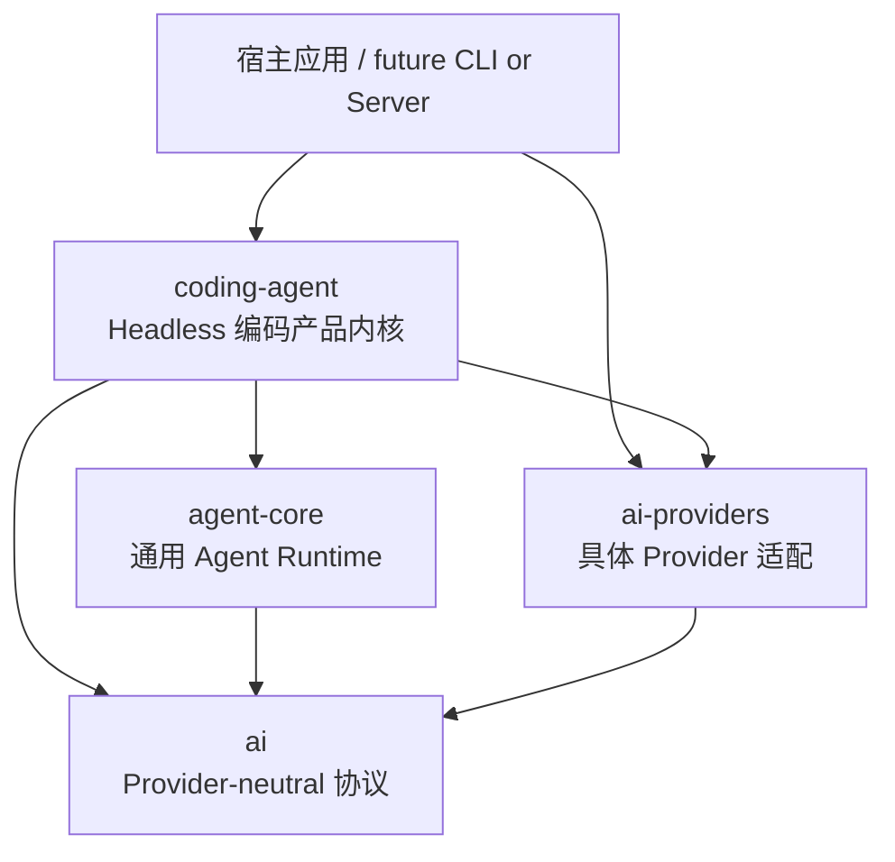

<div align="center">

# Jcode

**面向 Java 21 的 provider-neutral Agent Runtime 与 headless Coding Agent 内核**

[](https://openjdk.org/projects/jdk/21/)
[](https://maven.apache.org/)
[](docs/plans/archived/coding-agent-development-roadmap.md)

[特性](#核心特性) · [架构](#架构与模块) · [快速开始](#快速开始) · [嵌入应用](#嵌入应用) · [文档](#文档)

</div>

Jcode 是一个最小、可组合、可测试的 Java Agent 基础设施。它将模型协议、Provider 适配、通用 Agent Loop 与编码产品能力拆分为边界清晰的库模块，使应用可以显式选择模型、工具、权限策略、上下文与生命周期行为，而不依赖全局注册表或自动扫描。

> [!IMPORTANT]
> Jcode 当前处于开发阶段，版本为 `1.0-SNAPSHOT`，需要从源码构建。仓库只提供可嵌入的库模块，不包含 CLI、TUI、HTTP Server 或 Spring Boot 启动入口。

## 核心特性

- **Provider-neutral 模型协议**：统一模型标识、消息、内容、工具、usage、cost、流式事件、取消与 replay state。
- **确定的流式语义**：每个 assistant stream 都以唯一 terminal event 结束，并显式区分完成、错误和主动取消。
- **通用 Agent Runtime**：支持 steering、follow-up、背压事件、不可变状态快照与单 active run 生命周期。
- **统一工具管道**：工具调用遵循 `prepare → execute → finalize`，支持顺序/并行执行及 `BeforeToolCall`、`AfterToolCall` hook。
- **OpenAI Responses 适配**：基于 JDK `HttpClient` 与 Jackson 实现 HTTP/SSE，不依赖 Provider SDK；支持显式凭证、自定义 endpoint、兼容性、定价和有界重试配置。
- **Headless 编码能力**：通过 `CodingAgentSession` 提供 prompt、continue、steer、follow-up、abort、状态与产品事件接口。
- **Session 树与持久化**：支持默认内存历史、显式 JSONL create/open、append-only 分支、名称/标签、恢复诊断，以及显式目录的 list/latest/cwd 过滤。
- **设置与模型装配**：支持显式全局/项目设置、精确项目授信、SDK/env/只读文件凭证优先级、Models 目录、创建/恢复选择、idle 模型切换及原子默认值保存。
- **长会话压缩**：支持手动与请求前阈值压缩、append-only 摘要检查点、结构化上下文溢出单次恢复，以及显式分支摘要。
- **本地编码工具**：内置 `read`、`write`、`edit`、`bash`、`grep`、`find`、`ls`，工具集与授权策略均由调用方显式配置。
- **项目指令发现**：沿配置工作目录的词法祖先链依次尝试 `AGENTS.override.md`、`AGENTS.md`、`AGENTS.MD`，生成不可变上下文快照并组装 system prompt。
- **文本资源**：宿主显式启用后加载 Skill、Prompt Template、SYSTEM/APPEND 文本，提供来源、冲突、授信和解析诊断，并支持 idle 原子 reload。
- **显式 Java Extension**：宿主直接注册扩展实例，复用既有工具授权与执行管道，并提供命令、请求上下文变换、事件观察和生命周期通知。
- **扩展历史**：`custom` 状态和 `custom_message` 可见消息进入同一 append-only Session 树，支持 JSONL 重开、分支与压缩。

## 架构与模块



旧显式 API 仍允许宿主创建任意 `ModelClient`。新增的设置驱动工厂可以借用调用方 `Models`，也可以从显式 Provider 定义和凭证创建 Session 专用的 OpenAI Responses runtime；两种装配方式不自动混合。

| 模块 | 职责 | 内部依赖 |
| --- | --- | --- |
| [`ai`](ai/) | 模型、消息、流、工具、取消及 Provider runtime 抽象 | 无 |
| [`ai-providers`](ai-providers/) | 具体 Provider adapter；当前提供 OpenAI Responses API | `ai` |
| [`agent-core`](agent-core/) | Agent Loop、状态、事件、队列、hook 与工具执行管道 | `ai` |
| [`coding-agent`](coding-agent/) | 编码产品门面、设置/模型装配、Session、项目上下文、system prompt 与本地工具 | `ai`、`agent-core`、`ai-providers` |

Maven Enforcer 会在构建阶段检查这些依赖边界。

## 快速开始

### 环境要求

- JDK 21
- 系统安装的 Apache Maven（仓库不包含 Maven Wrapper）
- 可选：`grep` 需要显式配置 [ripgrep](https://github.com/BurntSushi/ripgrep)，`find` 需要显式配置 [fd](https://github.com/sharkdp/fd)

### 获取并构建

```bash
git clone https://github.com/YPQuinn/Jcode.git
cd Jcode
mvn clean install
```

常用校验命令：

```bash
# 运行全部测试
mvn test

# 完整项目校验
mvn verify

# 只测试指定模块及其依赖
mvn -pl coding-agent -am test
```

## 嵌入应用

当前仓库未配置公共 Maven 制品发布。执行 `mvn clean install` 后，可从本地 Maven 仓库引用产品内核和 Provider 实现：

```xml
<dependencies>
    <dependency>
        <groupId>site.pplee.jcode</groupId>
        <artifactId>coding-agent</artifactId>
        <version>1.0-SNAPSHOT</version>
    </dependency>
    <dependency>
        <groupId>site.pplee.jcode</groupId>
        <artifactId>ai-providers</artifactId>
        <version>1.0-SNAPSHOT</version>
    </dependency>
</dependencies>
```

下面的示例创建一个只读 Coding Agent。Provider 不会自动读取环境变量；示例由宿主应用读取 `OPENAI_API_KEY`，再显式传入凭证。

```java
// 省略 import；请将模型 ID 替换为账号可用的 OpenAI Responses 模型。
var model = new Model("openai", "openai-responses", "gpt-5", "GPT-5");
var providerConfig = OpenAiProviderConfig.responses(
        OpenAiCredentials.apiKey(System.getenv("OPENAI_API_KEY")),
        List.of(model));

try (var provider = new OpenAiProvider(providerConfig)) {
    var models = new DefaultModels(List.of(provider));
    var config = new CodingAgentConfig(
            Path.of("."),
            model.toRef(),
            models,
            new ObjectMapper(),
            ThinkingLevel.PROVIDER_DEFAULT,
            ModelRequestOptions.defaults(),
            QueueMode.ONE_AT_A_TIME,
            QueueMode.ONE_AT_A_TIME,
            null,                              // 使用默认 system prompt
            null,                              // 不追加额外 system prompt
            CodingAgentEventSink.noop(),
            Clock.systemUTC(),
            CodingToolConfig.readOnly(),
            ProjectContextConfig.project());

    try (var session = new CodingAgentSession(config)) {
        var result = session.prompt("概括当前项目的模块边界")
                .toCompletableFuture()
                .join();
        System.out.println(result.finalMessage().content());
    }
}
```

`CodingAgentSession` 还提供：

- `continueRun()`：从当前 leaf 的历史继续运行，不追加新的用户输入；
- `steer(String)`：向正在运行的任务加入 steering 消息；
- `followUp(String)`：排队后续任务；
- `abort()`：取消当前运行；
- `state()` / `isRunning()`：读取不可变状态快照；
- `reloadProjectContext()`：在空闲边界重新发现项目指令；
- `resources()` / `reloadResources()`：读取或原子重载当前文本资源快照；
- `expandTemplate(...)` / `expandSkill(...)` / `expandInput(...)`：显式展开已加载文本资源；
- `executeCommand(extensionId, commandName, arguments)`：执行扩展命令并接纳其固定历史记录，不隐式调用模型；
- `history()`、`branch(entryId)`、`resetLeaf()`：读取或切换 append-only 历史分支；
- `contextUsage()`、`compact(instructions)`：估算有效请求视图或在 idle 边界生成摘要检查点；
- `branchWithSummary(entryId, instructions)`：总结离开分支并把摘要追加到目标节点；
- `setName()`、`setLabel()`：追加名称或节点标签元数据。

默认构造只使用内存历史。文件模式必须由宿主显式调用 `CodingAgentSession.create(config, sessionDirectory)` 或 `open(config, sessionFile)`；可通过 `SessionFiles.list/latest` 扫描显式目录并按可选 cwd 过滤。`branch()` / `resetLeaf()` 不回滚工作区文件，`open()` 以调用方当前模型、工具和配置为准。普通 JSONL append 不逐条 `force()`，因此不承诺断电 durability。

设置驱动装配使用 `CodingAgentSessionFactory.inMemory/create/open` 与 `CodingAgentSessionOptions`。用户配置目录始终由宿主显式传入；项目 `.jcode/settings.json` 只有在 SDK 或独立 `trust.json` 明确允许时才读取。`SettingsFiles` 和 `ProjectTrustStore` 提供同步显式保存，`session.setModel(...)` 只改变当前会话，不自动修改默认设置。

文本资源默认关闭。启用后，默认来源为显式用户资源目录和已授信的 `<workingDirectory>/.jcode`；项目设置授权不会自动授权项目文本资源。普通 `prompt("/name ...")` 始终保留原文本，只有 `expandInput()` 才解释已存在的模板或 `/skill:name`。Java Extension 只接受宿主提供的实例，不扫描 classpath、不使用 `ServiceLoader`，也不执行项目目录中的 jar 或脚本。Session 关闭会在已接纳工作真实结束后发送一次反序生命周期通知，但不会替宿主调用借入扩展或扩展工具的 `close()`。

自动压缩默认关闭。启用时必须为当前 `ModelRef` 提供带 `contextWindow` 的 `ModelProfile`；`reserveTokens` 和 `keepRecentTokens` 按设置层逐叶继承：

```json
{
  "compaction": {
    "enabled": true,
    "reserveTokens": 2048,
    "keepRecentTokens": 3072
  }
}
```

历史中的 `CompactionEntry` 和 `BranchSummaryEntry` 始终参与请求视图重建，即使后来关闭自动生成。摘要只进入请求视图，不会改写或删除原始消息。

同目录中高优先级项目指令候选缺失、不是普通文件、不可读或不是合法 UTF-8 时，会继续尝试下一候选。System prompt 保留来源路径标记，但项目指令正文逐字拼接，不进行 XML 转义；总加载保留 1 MiB 聚合实际读取上限。Git worktree 识别失败不会阻止普通项目指令加载。

### 配置本地工具

默认 `CodingToolConfig.readOnly()` 仅启用 `read`。写文件、编辑文件和执行 shell 必须显式开启；搜索工具还需要分别提供 `rg`、`fd` 配置。典型工厂方法包括：

| 配置 | 启用工具 |
| --- | --- |
| `CodingToolConfig.readOnly()` | `read` |
| `CodingToolConfig.coding(bashConfig)` | `read`、`write`、`edit`、`bash` |
| `CodingToolConfig.codingWithSearch(bashConfig, searchConfig)` | 全部内置工具 |
| `new CodingToolConfig(...)` | 自定义工具集合、配置与 `CodingToolPolicy` |

```java
var tools = CodingToolConfig.codingWithSearch(
        new BashConfig(Path.of("/bin/bash")),
        new SearchConfig(Path.of("/absolute/path/to/rg"),
                Path.of("/absolute/path/to/fd"), null));
```

以上配置继承进程环境，Bash 无默认 timeout。非 null environment map 表示完全替换环境；旧四参数 `BashConfig` 仍可显式设置默认和最大 timeout。旧 `SearchConfig(rg, environment)` 仅配置 grep，启用 find 或完整 search profile 时需提供 fd。

`write/edit` 使用原生文件写入，不承诺原子替换或失败回滚；edit 支持精确优先、规范化回退匹配。搜索默认包含 hidden，glob/ignore 语义由 rg/fd 处理，grep 的显式 glob 可包含被 ignore 的文件。

严格 native 验证示例：

```bash
mvn -pl coding-agent -am verify -Plocal-tools-smoke \
  -Djcode.test.bash=/bin/bash \
  -Djcode.test.rg=/absolute/path/to/rg \
  -Djcode.test.fd=/absolute/path/to/fd
```

> [!WARNING]
> `workingDirectory` 用于路径解析和项目上下文发现，**不是文件系统 sandbox**。文件与 shell 工具以宿主 Java 进程的操作系统权限运行。处理不受信任的项目或提示词时，应通过 `CodingToolPolicy`、运行时 hook 和操作系统隔离实施授权与防护。

## 运行时模型

一次典型运行遵循以下边界：

1. 宿主应用显式选择 `ModelRef`、`ModelClient`、工具和策略。
2. `CodingAgentSession` 加载项目指令并构造 system prompt。
3. `agent-core` 驱动模型流，按背压顺序发布生命周期事件。
4. 模型提出的工具调用进入统一工具管道，可并行执行，但结果按原调用顺序稳定回填。
5. steering 与 follow-up 队列决定下一轮输入；取消信号由当前 run 独占。
6. Session 返回防御性复制的 `CodingAgentRunResult` 和状态快照。

这些约束让底层协议、运行时和产品层可以分别测试，也避免具体 Provider 或 UI 语义渗入通用 Agent Loop。

## 项目结构

```text
Jcode/
├── ai/                 # Provider-neutral 协议
├── ai-providers/       # Provider adapters
├── agent-core/         # 通用 Agent Runtime
├── coding-agent/       # Headless 编码产品内核
├── docs/
│   ├── architecture/   # 架构解读
│   ├── agents/         # 仓库开发约定
│   └── plans/          # 产品路线图与阶段计划
└── pom.xml             # Maven reactor 与依赖约束
```

## 文档

- [架构文档入口](docs/architecture/src/index.md)
- [项目全局视图](docs/architecture/src/00-overview.md)
- [Coding Agent 开发路线图（已归档）](docs/plans/archived/coding-agent-development-roadmap.md)
- [模块结构说明](docs/agents/project-structure.md)
- [架构与依赖边界](docs/agents/architecture-boundaries.md)
- [运行时正确性契约](docs/agents/runtime-contracts.md)
- [构建与测试指南](docs/agents/build-and-testing.md)
